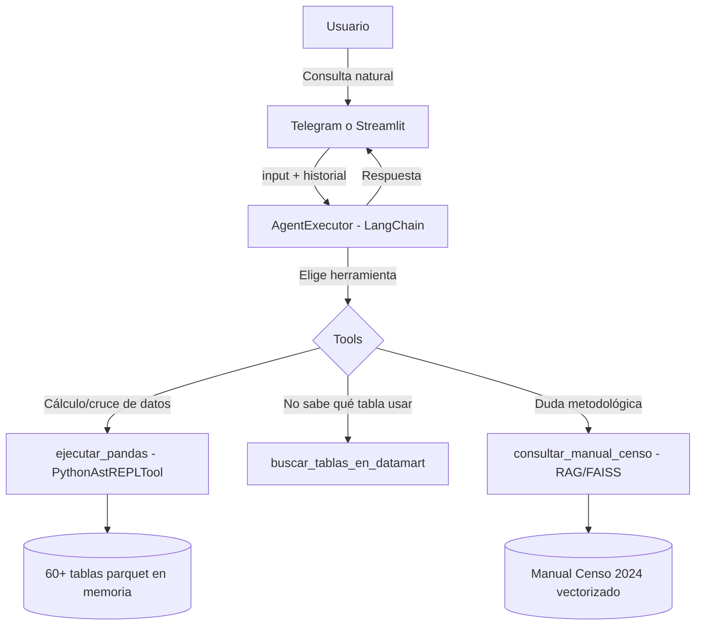

<p align="center">
  
</p>

<h1 align="center">🏔️ Sur DAO 2.0</h1>
<p align="center"><b>Agente Analítico Híbrido — Telegram + Centro de Mando Territorial (Streamlit)</b></p>
<p align="center">Datos sociodemográficos, educativos y censales de Chile (Censo 2024 + Mineduc)</p>

<p align="center">
  <a href="https://surdao-censo-educacion.streamlit.app/"><b>🌐 Ver Aplicación en Vivo (Streamlit Cloud)</b></a> • 
  <a href="https://t.me/SurdaoBot"><b>🤖 Probar Bot de Telegram</b></a>
</p>

---

## 💡 ¿Qué es Sur DAO 2.0?

Sur DAO 2.0 es un agente conversacional que combina un **datamart de 60+ tablas** (microdatos oficiales del Censo 2024 del INE y series históricas educativas del Mineduc, 2012-2025) con un LLM capaz de escribir y ejecutar código Python/pandas en memoria para responder preguntas con datos reales, no con texto genérico.

Disponible en dos interfaces que comparten el mismo agente (`agent_core.py`):

- 📱 **Telegram** ([@SurdaoBot](https://t.me/SurdaoBot)) — conversación natural con memoria por chat, caché de respuestas y comando `/buscar` para explorar el datamart.
- 🖥️ **Streamlit** ([App en Vivo](https://surdao-censo-educacion.streamlit.app/)) — chat web con mapa geográfico interactivo (`pydeck`) de establecimientos educacionales por comuna.

> 🚀 **Estado del Proyecto:** Validado en entorno local y desplegado en producción en Streamlit Cloud con un Datamart optimizado (archivos `.parquet` <2MB).

### 🎥 Demostración del Proyecto
Puedes revisar el video explicativo del funcionamiento del bot y del agente en el siguiente enlace:

👉 [Ver video demostrativo en Google Drive](https://drive.google.com/file/d/1OwauDaVPHrq276w4QE-g8GWnOKOHVI3I/view?usp=sharing)

👉 [Ver video demostrativo en Google Drive](https://drive.google.com/file/d/1P5U1C_74y6w4o9YXqFHRmDjRXSznCD1k/view?usp=sharing)

---

## 🏗️ Arquitectura



### 🤖 Agente analítico
- **Ejecución en memoria:** `PythonAstREPLTool` dentro de un `ThreadPoolExecutor` con timeout de 30s, para que una consulta pesada no cuelgue el chat.
- **Caché con TTL de 24h:** respuestas repetidas se sirven al instante vía hash MD5 de la pregunta.
- **Manejo de consultas complejas:** si una pregunta requiere demasiados pasos, el agente lo detecta y sugiere subpreguntas más acotadas en vez de fallar en silencio.
- **Buscador de tablas:** cuando no sabe en qué tabla está un dato, usa `buscar_tablas_en_datamart` para explorarlo por palabra clave antes de responder.

### 🖥️ Centro de mando (Streamlit)
- Barra lateral con buscador de las 60+ tablas activas en memoria.
- Mapa geográfico automático: al preguntar por una comuna, extrae las coordenadas de sus establecimientos y las renderiza en un mapa interactivo (`pydeck`).

---

## ⚙️ Stack Tecnológico

| Capa | Tecnología | Propósito |
|---|---|---|
| Orquestación del agente | `LangChain` (`create_tool_calling_agent` + `AgentExecutor`) | Razonamiento y selección de herramientas |
| Modelo de lenguaje | Endpoint OpenAI-compatible (Omniroute local u OpenRouter en la nube) | Generación de respuestas y código |
| Análisis de datos | `pandas` + `PythonAstREPLTool` | Cálculos sobre las tablas en memoria |
| RAG | `FAISS` + `HuggingFaceEmbeddings` (`all-MiniLM-L6-v2`) | Búsqueda semántica sobre el manual del Censo |
| Interfaz móvil | `python-telegram-bot` (polling) | Bot con memoria de conversación y caché |
| Interfaz web | `Streamlit` + `pydeck` | Chat y mapa geográfico interactivo |

## 🗄️ Datamart (`data/`)

surdao-censo-educacion/
├── app.py
├── telegram_bot.py
├── agent_core.py
├── requirements.txt
└── data/
    ├── manual_uso_microdatos_censo2024.pdf
    ├── educacion_historico_2012_2023.parquet
    ├── educacion_censo_2024.parquet
    ├── dataset_auditoria_final.parquet
    ├── D1_a_D6_*.parquet    # 20+ tablas demográficas (Edad, Sexo, Migración, Fecundidad)
    └── P1_a_P8_*.parquet    # 35+ tablas de diversidad (Discapacidad, Escolaridad, Pueblos)

## 🚀 Instalación y ejecución local

Requiere **Python 3.11** (el stack de LangChain usado no es compatible con Python 3.13+).

```bash
# 1. Clonar el repositorio
git clone https://github.com/tianhh77/surdao-censo-educacion.git
cd surdao-censo-educacion

# 2. Crear y activar entorno virtual con Python 3.11
py -3.11 -m venv venv
venv\Scripts\activate      # Windows
# source venv/bin/activate # Linux / Mac

# 3. Instalar dependencias
pip install -r requirements.txt

# 4. Crear un archivo .env (NO lo subas al repo) con:
#    TELEGRAM_BOT_TOKEN="tu_token_de_telegram"
#    OPENAI_API_KEY="tu_api_key_o_proveedor"

# 5a. Iniciar la app web
streamlit run app.py

# 5b. Iniciar el bot de Telegram (en otra terminal)
python telegram_bot.py
```

## 💬 Ejemplo real de uso

Recorrido comparativo entre Isla de Pascua y Juan Fernández hecho por el agente en una sola conversación de Telegram: demografía, discapacidad por tipo (visual, auditiva, motora, cognitiva), migración interna e internacional, escolaridad de inmigrantes vs. población local, asistencia educativa por nivel, y fecundidad — todo cruzando datos reales del datamart sin intervención manual.

## 🌍 Origen y filosofía

Todo el análisis se construye sobre **datos públicos oficiales** (INE, Mineduc) con herramientas gratuitas o de código abierto — el objetivo es que cualquiera pueda clonar este repositorio y levantar su propio centro de análisis territorial sin costo de licencias, usando modelos de LLM en capas gratuitas (Omniroute local u OpenRouter).

## 🗺️ Roadmap

- Despliegue público (Streamlit Community Cloud + bot de Telegram siempre activo).
- Ampliar el datamart con salud, vivienda o matriz económica.
- Seguimiento longitudinal de cohortes de estudiantes.

## 👤 Autor

Proyecto desarrollado como desafío final del programa de **Alura Latam**.
